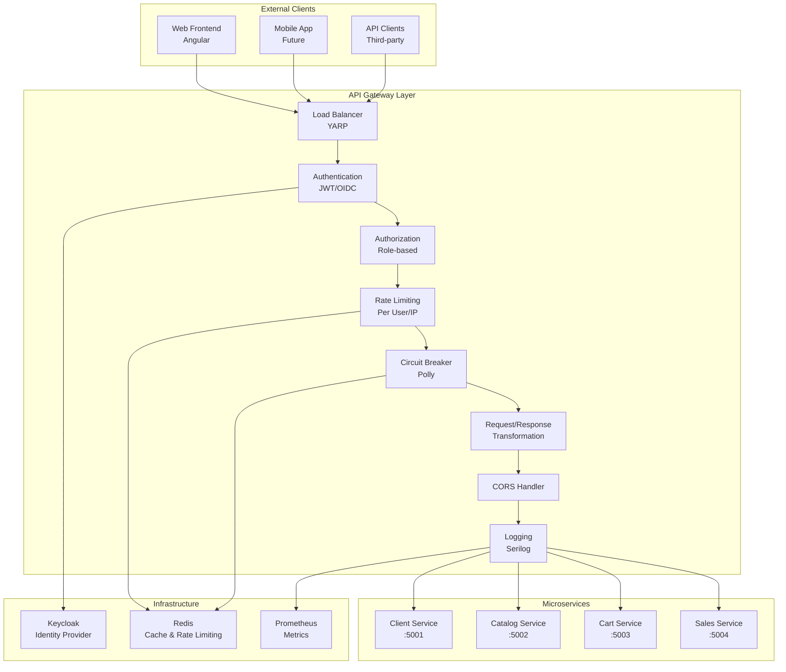

# Design Document - API Gateway

## Overview

O API Gateway é o ponto de entrada único para todas as requisições do B-Commerce, implementado com YARP (Yet Another Reverse Proxy) e ASP.NET Core. Responsável por roteamento, autenticação, autorização, rate limiting, circuit breaker, logging centralizado e transformações de requisições/respostas.

## Architecture

### High-Level Architecture



### Project Structure

```
ApiGateway/
├── src/
│   ├── ApiGateway.Api/                  # Main Gateway Application
│   │   ├── Program.cs
│   │   ├── appsettings.json
│   │   ├── appsettings.Development.json
│   │   └── appsettings.Production.json
│   ├── ApiGateway.Infrastructure/       # Infrastructure Layer
│   │   ├── Authentication/
│   │   │   ├── JwtAuthenticationHandler.cs
│   │   │   └── KeycloakAuthenticationOptions.cs
│   │   ├── Authorization/
│   │   │   ├── RoleAuthorizationHandler.cs
│   │   │   └── PolicyRequirements.cs
│   │   ├── RateLimiting/
│   │   │   ├── RedisRateLimitStore.cs
│   │   │   └── RateLimitingMiddleware.cs
│   │   ├── CircuitBreaker/
│   │   │   ├── CircuitBreakerMiddleware.cs
│   │   │   └── CircuitBreakerOptions.cs
│   │   ├── Logging/
│   │   │   ├── RequestLoggingMiddleware.cs
│   │   │   └── CorrelationIdMiddleware.cs
│   │   ├── Transformations/
│   │   │   ├── RequestTransformProvider.cs
│   │   │   └── ResponseTransformProvider.cs
│   │   └── HealthChecks/
│   │       ├── ServiceHealthCheck.cs
│   │       └── HealthCheckExtensions.cs
│   └── ApiGateway.Configuration/        # Configuration Layer
│       ├── RouteConfiguration.cs
│       ├── ServiceDiscovery.cs
│       └── GatewayOptions.cs
└── tests/
    ├── ApiGateway.UnitTests/
    ├── ApiGateway.IntegrationTests/
    └── ApiGateway.LoadTests/
```

## Components and Interfaces

### 1. Main Gateway Configuration

**Program.cs**
```csharp
using ApiGateway.Infrastructure.Authentication;
using ApiGateway.Infrastructure.Authorization;
using ApiGateway.Infrastructure.RateLimiting;
using ApiGateway.Infrastructure.CircuitBreaker;
using ApiGateway.Infrastructure.Logging;
using ApiGateway.Infrastructure.HealthChecks;
using Serilog;
using Polly;

var builder = WebApplication.CreateBuilder(args);

// Configure Serilog
Log.Logger = new LoggerConfiguration()
    .ReadFrom.Configuration(builder.Configuration)
    .Enrich.FromLogContext()
    .Enrich.WithCorrelationId()
    .WriteTo.Console()
    .WriteTo.Elasticsearch(builder.Configuration.GetConnectionString("Elasticsearch"))
    .CreateLogger();

builder.Host.UseSerilog();

// Add services
builder.Services.AddReverseProxy()
    .LoadFromConfig(builder.Configuration.GetSection("ReverseProxy"));

// Authentication & Authorization
builder.Services.AddAuthentication("Bearer")
    .AddJwtBearer("Bearer", options =>
    {
        var keycloakOptions = builder.Configuration.GetSection("Keycloak").Get<KeycloakOptions>();
        options.Authority = keycloakOptions.Authority;
        options.Audience = keycloakOptions.Audience;
        options.RequireHttpsMetadata = keycloakOptions.RequireHttpsMetadata;
        
        options.Events = new JwtBearerEvents
        {
            OnAuthenticationFailed = context =>
            {
                Log.Warning("Authentication failed: {Error}", context.Exception.Message);
                return Task.CompletedTask;
            },
            OnTokenValidated = context =>
            {
                Log.Information("Token validated for user: {UserId}", 
                    context.Principal?.FindFirst("sub")?.Value);
                return Task.CompletedTask;
            }
        };
    });

builder.Services.AddAuthorization(options =>
{
    options.AddPolicy("AdminOnly", policy => 
        policy.RequireRole("admin"));
    options.AddPolicy("CustomerOrAdmin", policy => 
        policy.RequireRole("customer", "admin"));
});

// Rate Limiting
builder.Services.AddStackExchangeRedisCache(options =>
{
    options.Configuration = builder.Configuration.GetConnectionString("Redis");
});
builder.Services.AddSingleton<IRateLimitStore, RedisRateLimitStore>();
builder.Services.Configure<RateLimitOptions>(builder.Configuration.GetSection("RateLimit"));

// Circuit Breaker
builder.Services.AddHttpClient();
builder.Services.Configure<CircuitBreakerOptions>(builder.Configuration.GetSection("CircuitBreaker"));

// Health Checks
builder.Services.AddHealthChecks()
    .AddCheck<ClientServiceHealthCheck>("client-service")
    .AddCheck<CatalogServiceHealthCheck>("catalog-service")
    .AddCheck<CartServiceHealthCheck>("cart-service")
    .AddCheck<SalesServiceHealthCheck>("sales-service")
    .AddRedis(builder.Configuration.GetConnectionString("Redis"))
    .AddUrlGroup(new Uri(builder.Configuration["Keycloak:Authority"]), "keycloak");

// CORS
builder.Services.AddCors(options =>
{
    options.AddPolicy("AllowFrontend", policy =>
    {
        policy.WithOrigins(builder.Configuration.GetSection("Cors:AllowedOrigins").Get<string[]>())
              .AllowAnyMethod()
              .AllowAnyHeader()
              .AllowCredentials();
    });
});

// Metrics
builder.Services.AddOpenTelemetry()
    .WithTracing(tracing => tracing
        .AddAspNetCoreInstrumentation()
        .AddHttpClientInstrumentation()
        .AddJaegerExporter())
    .WithMetrics(metrics => metrics
        .AddAspNetCoreInstrumentation()
        .AddHttpClientInstrumentation()
        .AddPrometheusExporter());

var app = builder.Build();

// Configure pipeline
if (app.Environment.IsDevelopment())
{
    app.UseDeveloperExceptionPage();
}

app.UseCorrelationId();
app.UseRequestLogging();
app.UseCors("AllowFrontend");
app.UseAuthentication();
app.UseAuthorization();
app.UseRateLimiting();
app.UseCircuitBreaker();

app.MapReverseProxy();
app.MapHealthChecks("/health");
app.MapPrometheusScrapingEndpoint();

app.Run();
```

**Route Configuration (appsettings.json)**
```json
{
  "Logging": {
    "LogLevel": {
      "Default": "Information",
      "Microsoft.AspNetCore": "Warning",
      "Yarp": "Information"
    }
  },
  "Keycloak": {
    "Authority": "http://localhost:8080/realms/b-commerce-realm",
    "Audience": "backend",
    "RequireHttpsMetadata": false
  },
  "ConnectionStrings": {
    "Redis": "localhost:6379",
    "Elasticsearch": "http://localhost:9200"
  },
  "Cors": {
    "AllowedOrigins": [
      "http://localhost:4200",
      "http://localhost:3000"
    ]
  },
  "RateLimit": {
    "DefaultPolicy": {
      "PermitLimit": 100,
      "Window": "00:01:00",
      "QueueLimit": 10
    },
    "Policies": {
      "AuthenticatedUser": {
        "PermitLimit": 200,
        "Window": "00:01:00",
        "QueueLimit": 20
      },
      "AdminUser": {
        "PermitLimit": 1000,
        "Window": "00:01:00",
        "QueueLimit": 50
      }
    }
  },
  "CircuitBreaker": {
    "DefaultPolicy": {
      "HandledEventsAllowedBeforeBreaking": 5,
      "DurationOfBreak": "00:00:30",
      "SamplingDuration": "00:01:00",
      "MinimumThroughput": 10
    }
  },
  "ReverseProxy": {
    "Routes": {
      "client-service-route": {
        "ClusterId": "client-service",
        "Match": {
          "Path": "/api/clients/{**catch-all}"
        },
        "Transforms": [
          {
            "PathPattern": "/api/clients/{**catch-all}"
          },
          {
            "RequestHeader": "X-Forwarded-For",
            "Append": "{RemoteIpAddress}"
          }
        ],
        "AuthorizationPolicy": "CustomerOrAdmin",
        "RateLimiterPolicy": "AuthenticatedUser"
      },
      "catalog-service-route": {
        "ClusterId": "catalog-service",
        "Match": {
          "Path": "/api/catalog/{**catch-all}"
        },
        "Transforms": [
          {
            "PathPattern": "/api/catalog/{**catch-all}"
          }
        ]
      },
      "catalog-admin-route": {
        "ClusterId": "catalog-service",
        "Match": {
          "Path": "/api/admin/catalog/{**catch-all}"
        },
        "Transforms": [
          {
            "PathPattern": "/api/catalog/{**catch-all}"
          }
        ],
        "AuthorizationPolicy": "AdminOnly",
        "RateLimiterPolicy": "AdminUser"
      },
      "cart-service-route": {
        "ClusterId": "cart-service",
        "Match": {
          "Path": "/api/cart/{**catch-all}"
        },
        "Transforms": [
          {
            "PathPattern": "/api/cart/{**catch-all}"
          }
        ],
        "AuthorizationPolicy": "CustomerOrAdmin",
        "RateLimiterPolicy": "AuthenticatedUser"
      },
      "sales-service-route": {
        "ClusterId": "sales-service",
        "Match": {
          "Path": "/api/orders/{**catch-all}"
        },
        "Transforms": [
          {
            "PathPattern": "/api/orders/{**catch-all}"
          }
        ],
        "AuthorizationPolicy": "CustomerOrAdmin",
        "RateLimiterPolicy": "AuthenticatedUser"
      }
    },
    "Clusters": {
      "client-service": {
        "Destinations": {
          "destination1": {
            "Address": "http://localhost:5001/"
          }
        },
        "HealthCheck": {
          "Active": {
            "Enabled": true,
            "Interval": "00:00:30",
            "Timeout": "00:00:05",
            "Policy": "ConsecutiveFailures",
            "Path": "/health"
          }
        }
      },
      "catalog-service": {
        "Destinations": {
          "destination1": {
            "Address": "http://localhost:5002/"
          }
        },
        "HealthCheck": {
          "Active": {
            "Enabled": true,
            "Interval": "00:00:30",
            "Timeout": "00:00:05",
            "Policy": "ConsecutiveFailures",
            "Path": "/health"
          }
        }
      },
      "cart-service": {
        "Destinations": {
          "destination1": {
            "Address": "http://localhost:5003/"
          }
        },
        "HealthCheck": {
          "Active": {
            "Enabled": true,
            "Interval": "00:00:30",
            "Timeout": "00:00:05",
            "Policy": "ConsecutiveFailures",
            "Path": "/health"
          }
        }
      },
      "sales-service": {
        "Destinations": {
          "destination1": {
            "Address": "http://localhost:5004/"
          }
        },
        "HealthCheck": {
          "Active": {
            "Enabled": true,
            "Interval": "00:00:30",
            "Timeout": "00:00:05",
            "Policy": "ConsecutiveFailures",
            "Path": "/health"
          }
        }
      }
    }
  }
}
```

### 2. Rate Limiting Implementation

**Rate Limiting Middleware**
```csharp
public class RateLimitingMiddleware
{
    private readonly RequestDelegate _next;
    private readonly IRateLimitStore _store;
    private readonly IOptions<RateLimitOptions> _options;
    private readonly ILogger<RateLimitingMiddleware> _logger;

    public RateLimitingMiddleware(
        RequestDelegate next,
        IRateLimitStore store,
        IOptions<RateLimitOptions> options,
        ILogger<RateLimitingMiddleware> logger)
    {
        _next = next;
        _store = store;
        _options = options;
        _logger = logger;
    }

    public async Task InvokeAsync(HttpContext context)
    {
        var endpoint = context.GetEndpoint();
        var rateLimitPolicy = endpoint?.Metadata.GetMetadata<IRateLimiterPolicy<string>>();
        
        if (rateLimitPolicy == null)
        {
            await _next(context);
            return;
        }

        var clientId = GetClientIdentifier(context);
        var policyName = GetPolicyName(context);
        var policy = GetRateLimitPolicy(policyName);

        var result = await _store.CheckRateLimitAsync(clientId, policy);

        // Add rate limit headers
        context.Response.Headers.Add("X-RateLimit-Limit", policy.PermitLimit.ToString());
        context.Response.Headers.Add("X-RateLimit-Remaining", Math.Max(0, policy.PermitLimit - result.RequestCount).ToString());
        context.Response.Headers.Add("X-RateLimit-Reset", result.ResetTime.ToString("yyyy-MM-ddTHH:mm:ssZ"));

        if (result.IsAllowed)
        {
            await _next(context);
        }
        else
        {
            _logger.LogWarning("Rate limit exceeded for client {ClientId} on policy {PolicyName}", 
                clientId, policyName);
                
            context.Response.StatusCode = 429;
            context.Response.Headers.Add("Retry-After", result.RetryAfter.ToString());
            
            await context.Response.WriteAsync(JsonSerializer.Serialize(new
            {
                error = "Rate limit exceeded",
                message = "Too many requests. Please try again later.",
                retryAfter = result.RetryAfter
            }));
        }
    }

    private string GetClientIdentifier(HttpContext context)
    {
        // Try to get user ID from JWT token
        var userId = context.User?.FindFirst("sub")?.Value;
        if (!string.IsNullOrEmpty(userId))
            return $"user:{userId}";

        // Fall back to IP address
        var ipAddress = context.Connection.RemoteIpAddress?.ToString();
        return $"ip:{ipAddress}";
    }

    private string GetPolicyName(HttpContext context)
    {
        if (context.User?.IsInRole("admin") == true)
            return "AdminUser";
        
        if (context.User?.Identity?.IsAuthenticated == true)
            return "AuthenticatedUser";
            
        return "DefaultPolicy";
    }

    private RateLimitPolicy GetRateLimitPolicy(string policyName)
    {
        return _options.Value.Policies.TryGetValue(policyName, out var policy) 
            ? policy 
            : _options.Value.DefaultPolicy;
    }
}
```

**Redis Rate Limit Store**
```csharp
public class RedisRateLimitStore : IRateLimitStore
{
    private readonly IDatabase _database;
    private readonly ILogger<RedisRateLimitStore> _logger;

    public RedisRateLimitStore(IConnectionMultiplexer redis, ILogger<RedisRateLimitStore> logger)
    {
        _database = redis.GetDatabase();
        _logger = logger;
    }

    public async Task<RateLimitResult> CheckRateLimitAsync(string clientId, RateLimitPolicy policy)
    {
        var key = $"rate_limit:{clientId}";
        var window = policy.Window;
        var now = DateTimeOffset.UtcNow;
        var windowStart = now.Add(-window);

        try
        {
            // Use Redis sorted set to track requests in time window
            var transaction = _database.CreateTransaction();
            
            // Remove old entries
            var removeOldTask = transaction.SortedSetRemoveRangeByScoreAsync(key, 0, windowStart.ToUnixTimeSeconds());
            
            // Add current request
            var addCurrentTask = transaction.SortedSetAddAsync(key, now.ToUnixTimeSeconds(), now.ToUnixTimeSeconds());
            
            // Get current count
            var countTask = transaction.SortedSetLengthAsync(key);
            
            // Set expiration
            var expireTask = transaction.KeyExpireAsync(key, window.Add(TimeSpan.FromMinutes(1)));
            
            await transaction.ExecuteAsync();
            
            var currentCount = await countTask;
            
            var isAllowed = currentCount <= policy.PermitLimit;
            var resetTime = windowStart.Add(window);
            var retryAfter = isAllowed ? 0 : (int)resetTime.Subtract(now).TotalSeconds;

            _logger.LogDebug("Rate limit check for {ClientId}: {CurrentCount}/{PermitLimit}, Allowed: {IsAllowed}", 
                clientId, currentCount, policy.PermitLimit, isAllowed);

            return new RateLimitResult
            {
                IsAllowed = isAllowed,
                RequestCount = (int)currentCount,
                ResetTime = resetTime,
                RetryAfter = retryAfter
            };
        }
        catch (Exception ex)
        {
            _logger.LogError(ex, "Error checking rate limit for client {ClientId}", clientId);
            
            // Fail open - allow request if Redis is unavailable
            return new RateLimitResult
            {
                IsAllowed = true,
                RequestCount = 0,
                ResetTime = now.Add(window),
                RetryAfter = 0
            };
        }
    }
}
```

### 3. Circuit Breaker Implementation

**Circuit Breaker Middleware**
```csharp
public class CircuitBreakerMiddleware
{
    private readonly RequestDelegate _next;
    private readonly ICircuitBreakerService _circuitBreakerService;
    private readonly ILogger<CircuitBreakerMiddleware> _logger;

    public CircuitBreakerMiddleware(
        RequestDelegate next,
        ICircuitBreakerService circuitBreakerService,
        ILogger<CircuitBreakerMiddleware> logger)
    {
        _next = next;
        _circuitBreakerService = circuitBreakerService;
        _logger = logger;
    }

    public async Task InvokeAsync(HttpContext context)
    {
        var serviceName = GetServiceName(context.Request.Path);
        if (string.IsNullOrEmpty(serviceName))
        {
            await _next(context);
            return;
        }

        var circuitBreaker = _circuitBreakerService.GetCircuitBreaker(serviceName);
        
        try
        {
            await circuitBreaker.ExecuteAsync(async () =>
            {
                await _next(context);
                
                // Check if response indicates a failure
                if (context.Response.StatusCode >= 500)
                {
                    throw new ServiceUnavailableException($"Service {serviceName} returned {context.Response.StatusCode}");
                }
            });
        }
        catch (CircuitBreakerOpenException)
        {
            _logger.LogWarning("Circuit breaker is open for service {ServiceName}", serviceName);
            
            context.Response.StatusCode = 503;
            await context.Response.WriteAsync(JsonSerializer.Serialize(new
            {
                error = "Service temporarily unavailable",
                message = $"The {serviceName} service is currently unavailable. Please try again later.",
                service = serviceName
            }));
        }
        catch (ServiceUnavailableException ex)
        {
            _logger.LogError(ex, "Service {ServiceName} is unavailable", serviceName);
            
            if (!context.Response.HasStarted)
            {
                context.Response.StatusCode = 503;
                await context.Response.WriteAsync(JsonSerializer.Serialize(new
                {
                    error = "Service unavailable",
                    message = ex.Message,
                    service = serviceName
                }));
            }
        }
    }

    private string GetServiceName(PathString path)
    {
        var segments = path.Value?.Split('/', StringSplitOptions.RemoveEmptyEntries);
        if (segments?.Length >= 2 && segments[0] == "api")
        {
            return segments[1] switch
            {
                "clients" => "client-service",
                "catalog" => "catalog-service",
                "cart" => "cart-service",
                "orders" => "sales-service",
                _ => null
            };
        }
        return null;
    }
}
```

**Circuit Breaker Service**
```csharp
public class CircuitBreakerService : ICircuitBreakerService
{
    private readonly ConcurrentDictionary<string, IAsyncPolicy> _circuitBreakers;
    private readonly IOptions<CircuitBreakerOptions> _options;
    private readonly ILogger<CircuitBreakerService> _logger;

    public CircuitBreakerService(IOptions<CircuitBreakerOptions> options, ILogger<CircuitBreakerService> logger)
    {
        _circuitBreakers = new ConcurrentDictionary<string, IAsyncPolicy>();
        _options = options;
        _logger = logger;
    }

    public IAsyncPolicy GetCircuitBreaker(string serviceName)
    {
        return _circuitBreakers.GetOrAdd(serviceName, CreateCircuitBreaker);
    }

    private IAsyncPolicy CreateCircuitBreaker(string serviceName)
    {
        var policy = _options.Value.DefaultPolicy;
        
        return Policy
            .Handle<HttpRequestException>()
            .Or<TaskCanceledException>()
            .Or<ServiceUnavailableException>()
            .CircuitBreakerAsync(
                handledEventsAllowedBeforeBreaking: policy.HandledEventsAllowedBeforeBreaking,
                durationOfBreak: policy.DurationOfBreak,
                onBreak: (exception, duration) =>
                {
                    _logger.LogWarning("Circuit breaker opened for service {ServiceName} for {Duration}. Exception: {Exception}", 
                        serviceName, duration, exception.Message);
                },
                onReset: () =>
                {
                    _logger.LogInformation("Circuit breaker reset for service {ServiceName}", serviceName);
                },
                onHalfOpen: () =>
                {
                    _logger.LogInformation("Circuit breaker half-open for service {ServiceName}", serviceName);
                }
            )
            .WrapAsync(Policy
                .Handle<HttpRequestException>()
                .Or<TaskCanceledException>()
                .WaitAndRetryAsync(
                    retryCount: 3,
                    sleepDurationProvider: retryAttempt => TimeSpan.FromSeconds(Math.Pow(2, retryAttempt)),
                    onRetry: (outcome, delay, retryCount, context) =>
                    {
                        _logger.LogWarning("Retry {RetryCount} for service {ServiceName} after {Delay}ms. Exception: {Exception}",
                            retryCount, serviceName, delay.TotalMilliseconds, outcome.Exception?.Message);
                    }
                )
            );
    }
}
```

### 4. Request/Response Logging

**Request Logging Middleware**
```csharp
public class RequestLoggingMiddleware
{
    private readonly RequestDelegate _next;
    private readonly ILogger<RequestLoggingMiddleware> _logger;

    public RequestLoggingMiddleware(RequestDelegate next, ILogger<RequestLoggingMiddleware> logger)
    {
        _next = next;
        _logger = logger;
    }

    public async Task InvokeAsync(HttpContext context)
    {
        var correlationId = context.TraceIdentifier;
        var stopwatch = Stopwatch.StartNew();
        
        // Log request
        _logger.LogInformation("HTTP {Method} {Path} started. CorrelationId: {CorrelationId}, UserAgent: {UserAgent}, RemoteIP: {RemoteIP}",
            context.Request.Method,
            context.Request.Path,
            correlationId,
            context.Request.Headers.UserAgent.ToString(),
            context.Connection.RemoteIpAddress?.ToString());

        try
        {
            await _next(context);
        }
        finally
        {
            stopwatch.Stop();
            
            var level = context.Response.StatusCode >= 500 ? LogEventLevel.Error :
                       context.Response.StatusCode >= 400 ? LogEventLevel.Warning :
                       LogEventLevel.Information;

            _logger.Write(level, "HTTP {Method} {Path} responded {StatusCode} in {ElapsedMs}ms. CorrelationId: {CorrelationId}",
                context.Request.Method,
                context.Request.Path,
                context.Response.StatusCode,
                stopwatch.ElapsedMilliseconds,
                correlationId);
        }
    }
}
```

**Correlation ID Middleware**
```csharp
public class CorrelationIdMiddleware
{
    private readonly RequestDelegate _next;
    private const string CorrelationIdHeaderName = "X-Correlation-ID";

    public CorrelationIdMiddleware(RequestDelegate next)
    {
        _next = next;
    }

    public async Task InvokeAsync(HttpContext context)
    {
        var correlationId = GetCorrelationId(context);
        
        // Add to response headers
        context.Response.Headers.Add(CorrelationIdHeaderName, correlationId);
        
        // Add to logging context
        using (LogContext.PushProperty("CorrelationId", correlationId))
        {
            // Forward to downstream services
            context.Request.Headers.Add(CorrelationIdHeaderName, correlationId);
            
            await _next(context);
        }
    }

    private string GetCorrelationId(HttpContext context)
    {
        // Try to get from request headers first
        if (context.Request.Headers.TryGetValue(CorrelationIdHeaderName, out var correlationId) &&
            !string.IsNullOrEmpty(correlationId))
        {
            return correlationId;
        }

        // Generate new correlation ID
        return Guid.NewGuid().ToString();
    }
}
```

### 5. Health Checks

**Service Health Check**
```csharp
public class ClientServiceHealthCheck : IHealthCheck
{
    private readonly HttpClient _httpClient;
    private readonly ILogger<ClientServiceHealthCheck> _logger;

    public ClientServiceHealthCheck(HttpClient httpClient, ILogger<ClientServiceHealthCheck> logger)
    {
        _httpClient = httpClient;
        _logger = logger;
    }

    public async Task<HealthCheckResult> CheckHealthAsync(HealthCheckContext context, CancellationToken cancellationToken = default)
    {
        try
        {
            var response = await _httpClient.GetAsync("http://localhost:5001/health", cancellationToken);
            
            if (response.IsSuccessStatusCode)
            {
                var responseTime = response.Headers.Date?.Subtract(DateTimeOffset.UtcNow).Duration().TotalMilliseconds ?? 0;
                
                return HealthCheckResult.Healthy($"Client service is healthy. Response time: {responseTime}ms", 
                    new Dictionary<string, object>
                    {
                        ["response_time_ms"] = responseTime,
                        ["status_code"] = (int)response.StatusCode
                    });
            }
            else
            {
                return HealthCheckResult.Degraded($"Client service returned {response.StatusCode}",
                    data: new Dictionary<string, object>
                    {
                        ["status_code"] = (int)response.StatusCode
                    });
            }
        }
        catch (Exception ex)
        {
            _logger.LogError(ex, "Health check failed for Client Service");
            return HealthCheckResult.Unhealthy("Client service is unreachable", ex);
        }
    }
}
```

## Data Models

### Configuration Models

**Gateway Options**
```csharp
public class GatewayOptions
{
    public KeycloakOptions Keycloak { get; set; } = new();
    public RateLimitOptions RateLimit { get; set; } = new();
    public CircuitBreakerOptions CircuitBreaker { get; set; } = new();
    public CorsOptions Cors { get; set; } = new();
}

public class KeycloakOptions
{
    public string Authority { get; set; } = string.Empty;
    public string Audience { get; set; } = string.Empty;
    public bool RequireHttpsMetadata { get; set; } = true;
}

public class RateLimitOptions
{
    public RateLimitPolicy DefaultPolicy { get; set; } = new();
    public Dictionary<string, RateLimitPolicy> Policies { get; set; } = new();
}

public class RateLimitPolicy
{
    public int PermitLimit { get; set; } = 100;
    public TimeSpan Window { get; set; } = TimeSpan.FromMinutes(1);
    public int QueueLimit { get; set; } = 10;
}

public class CircuitBreakerOptions
{
    public CircuitBreakerPolicy DefaultPolicy { get; set; } = new();
    public Dictionary<string, CircuitBreakerPolicy> Policies { get; set; } = new();
}

public class CircuitBreakerPolicy
{
    public int HandledEventsAllowedBeforeBreaking { get; set; } = 5;
    public TimeSpan DurationOfBreak { get; set; } = TimeSpan.FromSeconds(30);
    public TimeSpan SamplingDuration { get; set; } = TimeSpan.FromMinutes(1);
    public int MinimumThroughput { get; set; } = 10;
}
```

## Error Handling

### Global Exception Handler

```csharp
public class GlobalExceptionMiddleware
{
    private readonly RequestDelegate _next;
    private readonly ILogger<GlobalExceptionMiddleware> _logger;

    public GlobalExceptionMiddleware(RequestDelegate next, ILogger<GlobalExceptionMiddleware> logger)
    {
        _next = next;
        _logger = logger;
    }

    public async Task InvokeAsync(HttpContext context)
    {
        try
        {
            await _next(context);
        }
        catch (Exception ex)
        {
            _logger.LogError(ex, "An unhandled exception occurred. CorrelationId: {CorrelationId}", 
                context.TraceIdentifier);
            await HandleExceptionAsync(context, ex);
        }
    }

    private static async Task HandleExceptionAsync(HttpContext context, Exception exception)
    {
        var response = context.Response;
        response.ContentType = "application/json";

        var errorResponse = exception switch
        {
            CircuitBreakerOpenException => new 
            { 
                error = "Service temporarily unavailable", 
                message = "The requested service is currently unavailable. Please try again later.",
                statusCode = 503,
                correlationId = context.TraceIdentifier
            },
            ServiceUnavailableException => new 
            { 
                error = "Service unavailable", 
                message = exception.Message,
                statusCode = 503,
                correlationId = context.TraceIdentifier
            },
            UnauthorizedAccessException => new 
            { 
                error = "Unauthorized", 
                message = "Access denied",
                statusCode = 401,
                correlationId = context.TraceIdentifier
            },
            _ => new 
            { 
                error = "Internal server error", 
                message = "An error occurred while processing your request",
                statusCode = 500,
                correlationId = context.TraceIdentifier
            }
        };

        response.StatusCode = errorResponse.statusCode;
        await response.WriteAsync(JsonSerializer.Serialize(errorResponse));
    }
}
```

## Testing Strategy

### Integration Tests

```csharp
[TestClass]
public class GatewayIntegrationTests : IClassFixture<WebApplicationFactory<Program>>
{
    private readonly WebApplicationFactory<Program> _factory;
    private readonly HttpClient _client;

    public GatewayIntegrationTests(WebApplicationFactory<Program> factory)
    {
        _factory = factory;
        _client = _factory.CreateClient();
    }

    [TestMethod]
    public async Task GetCatalog_WithoutAuthentication_ShouldReturnSuccess()
    {
        // Act
        var response = await _client.GetAsync("/api/catalog/products");

        // Assert
        Assert.AreEqual(HttpStatusCode.OK, response.StatusCode);
        Assert.IsTrue(response.Headers.Contains("X-Correlation-ID"));
    }

    [TestMethod]
    public async Task GetCart_WithoutAuthentication_ShouldReturnUnauthorized()
    {
        // Act
        var response = await _client.GetAsync("/api/cart/123");

        // Assert
        Assert.AreEqual(HttpStatusCode.Unauthorized, response.StatusCode);
    }

    [TestMethod]
    public async Task GetCart_WithValidToken_ShouldReturnSuccess()
    {
        // Arrange
        var token = await GetValidJwtTokenAsync();
        _client.DefaultRequestHeaders.Authorization = new AuthenticationHeaderValue("Bearer", token);

        // Act
        var response = await _client.GetAsync("/api/cart/123");

        // Assert
        Assert.AreEqual(HttpStatusCode.OK, response.StatusCode);
    }

    [TestMethod]
    public async Task RateLimit_ExceedingLimit_ShouldReturnTooManyRequests()
    {
        // Arrange
        var tasks = new List<Task<HttpResponse>>();
        
        // Act - Send more requests than the rate limit allows
        for (int i = 0; i < 150; i++)
        {
            tasks.Add(_client.GetAsync("/api/catalog/products"));
        }
        
        var responses = await Task.WhenAll(tasks);

        // Assert
        Assert.IsTrue(responses.Any(r => r.StatusCode == HttpStatusCode.TooManyRequests));
        
        var rateLimitedResponse = responses.First(r => r.StatusCode == HttpStatusCode.TooManyRequests);
        Assert.IsTrue(rateLimitedResponse.Headers.Contains("X-RateLimit-Limit"));
        Assert.IsTrue(rateLimitedResponse.Headers.Contains("Retry-After"));
    }
}
```

### Load Tests

```csharp
[TestClass]
public class GatewayLoadTests
{
    private readonly HttpClient _client;

    public GatewayLoadTests()
    {
        _client = new HttpClient { BaseAddress = new Uri("http://localhost:5000") };
    }

    [TestMethod]
    public async Task LoadTest_ConcurrentRequests_ShouldHandleLoad()
    {
        // Arrange
        const int concurrentUsers = 100;
        const int requestsPerUser = 10;
        var semaphore = new SemaphoreSlim(concurrentUsers);
        var tasks = new List<Task<LoadTestResult>>();

        // Act
        for (int user = 0; user < concurrentUsers; user++)
        {
            tasks.Add(SimulateUserLoad(user, requestsPerUser, semaphore));
        }

        var results = await Task.WhenAll(tasks);

        // Assert
        var totalRequests = results.Sum(r => r.TotalRequests);
        var successfulRequests = results.Sum(r => r.SuccessfulRequests);
        var averageResponseTime = results.Average(r => r.AverageResponseTime);

        Assert.IsTrue(successfulRequests > totalRequests * 0.95, "Success rate should be > 95%");
        Assert.IsTrue(averageResponseTime < 1000, "Average response time should be < 1000ms");
        
        Console.WriteLine($"Total Requests: {totalRequests}");
        Console.WriteLine($"Successful Requests: {successfulRequests}");
        Console.WriteLine($"Success Rate: {(double)successfulRequests / totalRequests:P2}");
        Console.WriteLine($"Average Response Time: {averageResponseTime:F2}ms");
    }

    private async Task<LoadTestResult> SimulateUserLoad(int userId, int requestCount, SemaphoreSlim semaphore)
    {
        await semaphore.WaitAsync();
        
        try
        {
            var stopwatch = Stopwatch.StartNew();
            var successCount = 0;
            var responseTimes = new List<long>();

            for (int i = 0; i < requestCount; i++)
            {
                var requestStopwatch = Stopwatch.StartNew();
                
                try
                {
                    var response = await _client.GetAsync("/api/catalog/products");
                    requestStopwatch.Stop();
                    
                    if (response.IsSuccessStatusCode)
                        successCount++;
                        
                    responseTimes.Add(requestStopwatch.ElapsedMilliseconds);
                }
                catch
                {
                    requestStopwatch.Stop();
                    responseTimes.Add(requestStopwatch.ElapsedMilliseconds);
                }
                
                // Small delay between requests
                await Task.Delay(Random.Shared.Next(10, 100));
            }

            stopwatch.Stop();

            return new LoadTestResult
            {
                UserId = userId,
                TotalRequests = requestCount,
                SuccessfulRequests = successCount,
                TotalTime = stopwatch.ElapsedMilliseconds,
                AverageResponseTime = responseTimes.Average()
            };
        }
        finally
        {
            semaphore.Release();
        }
    }
}

public class LoadTestResult
{
    public int UserId { get; set; }
    public int TotalRequests { get; set; }
    public int SuccessfulRequests { get; set; }
    public long TotalTime { get; set; }
    public double AverageResponseTime { get; set; }
}
```

## Monitoring and Observability

### Metrics Collection

```csharp
public class MetricsMiddleware
{
    private readonly RequestDelegate _next;
    private readonly Counter<int> _requestCounter;
    private readonly Histogram<double> _requestDuration;
    private readonly Counter<int> _errorCounter;

    public MetricsMiddleware(RequestDelegate next, IMeterFactory meterFactory)
    {
        _next = next;
        var meter = meterFactory.Create("ApiGateway");
        
        _requestCounter = meter.CreateCounter<int>("gateway_requests_total", "Total number of requests");
        _requestDuration = meter.CreateHistogram<double>("gateway_request_duration_seconds", "Request duration in seconds");
        _errorCounter = meter.CreateCounter<int>("gateway_errors_total", "Total number of errors");
    }

    public async Task InvokeAsync(HttpContext context)
    {
        var stopwatch = Stopwatch.StartNew();
        var tags = new TagList
        {
            ["method"] = context.Request.Method,
            ["path"] = GetNormalizedPath(context.Request.Path)
        };

        try
        {
            await _next(context);
            
            tags["status_code"] = context.Response.StatusCode.ToString();
            _requestCounter.Add(1, tags);
            
            if (context.Response.StatusCode >= 400)
            {
                _errorCounter.Add(1, tags);
            }
        }
        catch (Exception)
        {
            tags["status_code"] = "500";
            _requestCounter.Add(1, tags);
            _errorCounter.Add(1, tags);
            throw;
        }
        finally
        {
            stopwatch.Stop();
            _requestDuration.Record(stopwatch.Elapsed.TotalSeconds, tags);
        }
    }

    private string GetNormalizedPath(PathString path)
    {
        // Normalize paths to avoid high cardinality metrics
        var segments = path.Value?.Split('/', StringSplitOptions.RemoveEmptyEntries);
        if (segments?.Length >= 2 && segments[0] == "api")
        {
            return $"/api/{segments[1]}/*";
        }
        return path.Value ?? "/";
    }
}
```

O design do API Gateway está completo! Ele implementa todas as funcionalidades necessárias usando YARP, incluindo roteamento inteligente, autenticação JWT/OIDC, autorização baseada em roles, rate limiting com Redis, circuit breaker com Polly, logging estruturado, CORS, health checks, métricas e testes de carga.

As specs de todos os 6 microserviços estão agora completas com documentos de requirements e design detalhados, prontas para a próxima fase de implementação!