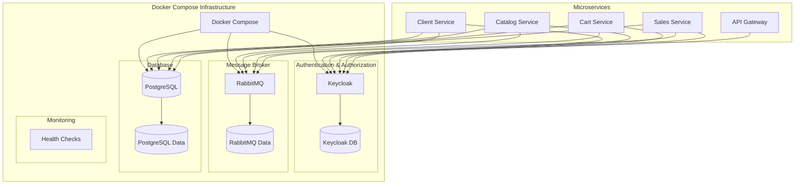

# Design Document - Infra Service

## Overview

O Infra Service é implementado como uma configuração Docker Compose que orquestra todos os serviços de infraestrutura necessários para o B-Commerce. O design foca em simplicidade, confiabilidade e facilidade de desenvolvimento, utilizando containers Docker para isolar cada serviço e scripts de inicialização para automatizar a configuração.

## Architecture



## Components and Interfaces

### Docker Compose Configuration
- **Arquivo Principal**: `docker-compose.yml` na raiz do projeto
- **Redes**: Rede interna `b-commerce-network` para comunicação entre serviços
- **Volumes**: Volumes nomeados para persistência de dados

### Keycloak Configuration
- **Imagem**: `quay.io/keycloak/keycloak:latest`
- **Porta**: 8080
- **Database**: PostgreSQL dedicado para Keycloak
- **Configuração**: Scripts de inicialização para realm e clients
- **Variáveis de Ambiente**:
  - `KEYCLOAK_ADMIN`: admin
  - `KEYCLOAK_ADMIN_PASSWORD`: admin123
  - `KC_DB`: postgres
  - `KC_DB_URL`: jdbc:postgresql://keycloak-db:5432/keycloak

### RabbitMQ Configuration
- **Imagem**: `rabbitmq:3-management`
- **Portas**: 5672 (AMQP), 15672 (Management UI)
- **Configuração**: Definitions file para exchanges e queues
- **Variáveis de Ambiente**:
  - `RABBITMQ_DEFAULT_USER`: admin
  - `RABBITMQ_DEFAULT_PASS`: admin123
- **Exchanges**:
  - `client.events` (topic)
  - `catalog.events` (topic)
  - `cart.events` (topic)
  - `sales.events` (topic)

### PostgreSQL Configuration
- **Imagem**: `postgres:15`
- **Porta**: 5432
- **Databases**: 
  - `bcommerce` (aplicação principal)
  - `keycloak` (Keycloak)
- **Variáveis de Ambiente**:
  - `POSTGRES_DB`: bcommerce
  - `POSTGRES_USER`: bcommerce_user
  - `POSTGRES_PASSWORD`: bcommerce_pass
- **Scripts de Inicialização**: 
  - `database.sql` (schema)
  - `seed.sql` (dados iniciais)

## Data Models

### Docker Compose Services Structure
```yaml
services:
  keycloak:
    image: quay.io/keycloak/keycloak:latest
    environment: [configurações]
    ports: ["8080:8080"]
    depends_on: [keycloak-db]
    
  keycloak-db:
    image: postgres:15
    environment: [configurações específicas]
    
  rabbitmq:
    image: rabbitmq:3-management
    environment: [configurações]
    ports: ["5672:5672", "15672:15672"]
    
  postgres:
    image: postgres:15
    environment: [configurações]
    ports: ["5432:5432"]
    volumes: [scripts de inicialização]
```

### Keycloak Realm Configuration
```json
{
  "realm": "b-commerce-realm",
  "enabled": true,
  "clients": [
    {
      "clientId": "b-commerce-frontend",
      "publicClient": true,
      "redirectUris": ["http://localhost:4200/*"]
    },
    {
      "clientId": "b-commerce-backend",
      "serviceAccountsEnabled": true,
      "authorizationServicesEnabled": true
    }
  ],
  "roles": {
    "realm": [
      {"name": "USER"},
      {"name": "ADMIN"}
    ]
  }
}
```

### RabbitMQ Definitions
```json
{
  "exchanges": [
    {"name": "client.events", "type": "topic"},
    {"name": "catalog.events", "type": "topic"},
    {"name": "cart.events", "type": "topic"},
    {"name": "sales.events", "type": "topic"}
  ],
  "queues": [
    {"name": "cliente.cadastro", "durable": true},
    {"name": "catalogo.atualizacao.estoque", "durable": true},
    {"name": "carrinho.abandonado", "durable": true},
    {"name": "vendas.pedido.criado", "durable": true}
  ]
}
```

## Error Handling

### Container Health Checks
- Cada serviço terá health checks configurados
- Restart policies para recuperação automática
- Timeouts apropriados para inicialização

### Database Connection Resilience
- Connection pooling configurado
- Retry logic para conexões iniciais
- Backup e recovery procedures documentados

### Message Broker Resilience
- Persistent queues para mensagens críticas
- Dead letter queues para mensagens com falha
- Monitoring de filas e exchanges

## Testing Strategy

### Infrastructure Testing
- **Smoke Tests**: Verificar se todos os serviços sobem corretamente
- **Connectivity Tests**: Testar conexões entre serviços
- **Configuration Tests**: Validar configurações do Keycloak e RabbitMQ

### Integration Testing
- **Database Schema Tests**: Verificar se o schema é criado corretamente
- **Authentication Tests**: Testar fluxo de autenticação via Keycloak
- **Messaging Tests**: Verificar publicação e consumo de mensagens

### Performance Testing
- **Load Tests**: Testar capacidade dos serviços sob carga
- **Resource Usage**: Monitorar uso de CPU e memória
- **Network Latency**: Medir latência entre serviços

### Disaster Recovery Testing
- **Backup/Restore**: Testar procedimentos de backup e restore
- **Failover**: Simular falhas e testar recuperação
- **Data Consistency**: Verificar integridade dos dados após falhas